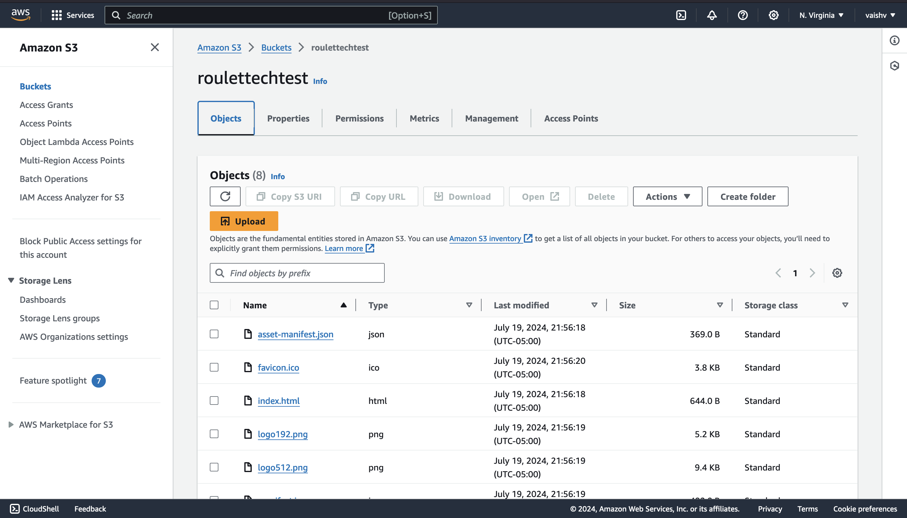
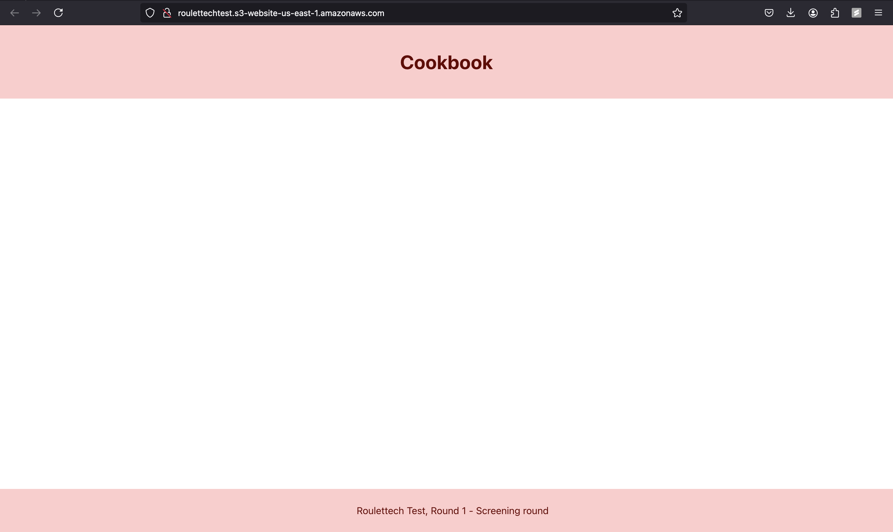
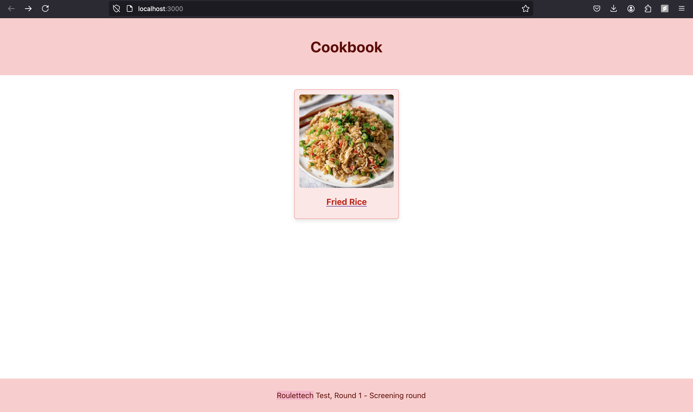
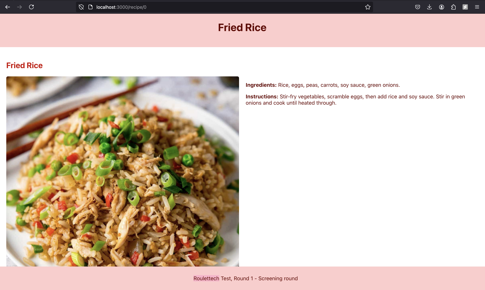
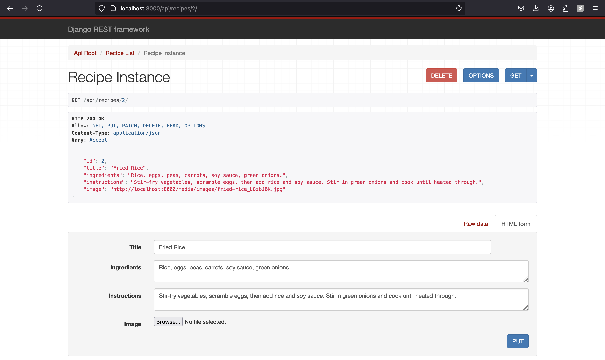

# RouletteTech Cookbook

This project is a simple cookbook web application developed as part of a take-home assignment for the Junior Software Engineer position at Roulettech Inc. The application uses React.js for the frontend and Django for the backend, and it is deployed on AWS using S3 and EC2.

## Table of Contents

- [Overview](#overview)
- [Tech Stack](#tech-stack)
- [Architecture](#architecture)
- [Frontend Setup](#frontend-setup)
- [Backend Setup](#backend-setup)
- [AWS Deployment](#aws-deployment)
- [How to Run the Project](#how-to-run-the-project)
- [Using the Application](#using-the-application)
- [Presentation](#presentation)

## Overview

The RouletteTech Cookbook application allows users to view a list of recipes and click on each recipe to see detailed ingredients and instructions. The backend provides API endpoints to fetch the list of recipes and individual recipe details.

## Tech Stack

- **Frontend**: React.js
- **Backend**: Django
- **Database**: SQLite (for development)
- **Deployment**: AWS S3, AWS EC2
- **Additional Tools**: Axios for HTTP requests, React Router for navigation

## Architecture

The project is structured into two main directories:

1. **backend**: Contains the Django backend application.
2. **roulettech-test**: Contains the React frontend application.

## Frontend Setup

### Directory Structure

```
roulettech-test/
├── build/
├── node_modules/
├── public/
├── src/
│   ├── components/
│   ├── helpers/
│   ├── images/
│   ├── App.js
│   ├── index.js
│   ├── ...
├── .gitignore
├── package.json
├── package-lock.json
├── README.md
└── roulettech.pem
```

### Setup Instructions

1. Navigate to the `roulettech-test` directory.

    ```bash
    cd roulettech-test
    ```

2. Install the required dependencies.

    ```bash
    npm install
    ```

3. Start the React development server.

    ```bash
    npm start
    ```

## Backend Setup

### Directory Structure

```
backend/
├── api/
├── env/
├── media/
├── screening/
├── .gitignore
├── db.sqlite3
├── manage.py
```

### Setup Instructions

1. Navigate to the `backend` directory.

    ```bash
    cd backend
    ```

2. Create and activate a virtual environment.

    ```bash
    python3 -m venv env
    source env/bin/activate
    ```

3. Install the required dependencies.

    ```bash
    pip install -r requirements.txt
    ```

4. Apply the migrations.

    ```bash
    python manage.py migrate
    ```

5. Create a superuser to access the Django admin interface.

    ```bash
    python manage.py createsuperuser
    ```

6. Start the Django development server.

    ```bash
    python manage.py runserver
    ```

## AWS Deployment

### Frontend Deployment to S3



1. Build the React application.

    ```bash
    npm run build
    ```

2. Deploy the `build` directory to your S3 bucket.

    ```bash
    aws s3 sync build/ s3://your-s3-bucket-name
    ```

### Backend Deployment to EC2

1. SSH into your EC2 instance.

    ```bash
    ssh -i roulettech.pem ubuntu@your-ec2-public-ip
    ```

2. Install required packages.

    ```bash
    sudo apt update
    sudo apt install python3-pip python3-dev nginx
    ```

3. Clone your project repository.

    ```bash
    git clone https://github.com/your-repo-url
    cd backend
    ```

4. Set up the virtual environment and install dependencies.

    ```bash
    python3 -m venv env
    source env/bin/activate
    pip install -r requirements.txt
    ```

5. Apply the migrations.

    ```bash
    python manage.py migrate
    ```

6. Configure and start Gunicorn.

    ```bash
    gunicorn --workers 3 screening.wsgi:application
    ```

7. Configure Nginx as a reverse proxy.

    - Edit the Nginx configuration file to point to your Gunicorn server.

    ```bash
    sudo nano /etc/nginx/sites-available/your-domain
    ```

    - Add the following configuration:

    ```nginx
    server {
        listen 80;
        server_name your-domain.com;

        location / {
            proxy_pass http://127.0.0.1:8000;
            proxy_set_header Host $host;
            proxy_set_header X-Real-IP $remote_addr;
            proxy_set_header X-Forwarded-For $proxy_add_x_forwarded_for;
            proxy_set_header X-Forwarded-Proto $scheme;
        }
    }
    ```

    - Enable the configuration and restart Nginx.

    ```bash
    sudo ln -s /etc/nginx/sites-available/your-domain /etc/nginx/sites-enabled
    sudo systemctl restart nginx
    ```

## How to Run the Project

1. **Start the Frontend**: Navigate to `roulettech-test` and run `npm start`.
2. **Start the Backend**: Navigate to `backend`, activate the virtual environment, and run `python manage.py runserver`.
3. **Access the Application**: Open your browser and navigate to `http://localhost:3000` for the frontend and `http://localhost:8000/api/recipes/` for the backend and add a recipe.
4. **New Recipe Reflected on the Frontend**: After adding a new recipe on the backend, you can see the changes being reflected on the frontend.




## Using the Application

### Adding Recipes to the Backend

To add recipes to the backend, you can use the Django admin interface or directly interact with the API endpoints using tools like Postman or cURL.


#### Using API Endpoints

##### Create a New Recipe
- **Endpoint**: `POST /api/recipes/`
- **Request Body**:
  ```json
  {
    "title": "New Recipe",
    "ingredients": "List of ingredients",
    "instructions": "Step-by-step instructions",
    "image_url": "URL of the image"
  }
  ```

##### Retrieve All Recipes
- **Endpoint**: `GET /api/recipes/`

##### Retrieve a Single Recipe
- **Endpoint**: `GET /api/recipes/{id}/`

##### Update a Recipe
- **Endpoint**: `PUT /api/recipes/{id}/`
- **Request Body**:
  ```json
  {
    "title": "Updated Recipe",
    "ingredients": "Updated list of ingredients",
    "instructions": "Updated instructions",
    "image_url": "Updated URL of the image"
  }
  ```

##### Delete a Recipe
- **Endpoint**: `DELETE /api/recipes/{id}/`

### CRUD Operations

The backend API supports CRUD (Create, Read, Update, Delete) operations for managing recipes. Here is an overview of the available API endpoints:

- **Create**: `POST /api/recipes/` - Add a new recipe.
- **Read**: 
  - `GET /api/recipes/` - Retrieve all recipes.
  - `GET /api/recipes/{id}/` - Retrieve a specific recipe by ID.
- **Update**: `PUT /api/recipes/{id}/` - Update an existing recipe.
- **Delete**: `DELETE /api/recipes/{id}/` - Delete a recipe by ID.


## Presentation

A detailed presentation of the project, including an overview of the tech stack, architecture, and deployment process, is included in the repository as `Presentation.pdf`.

## Live Demo

You can access the live demo of the project [here]().
